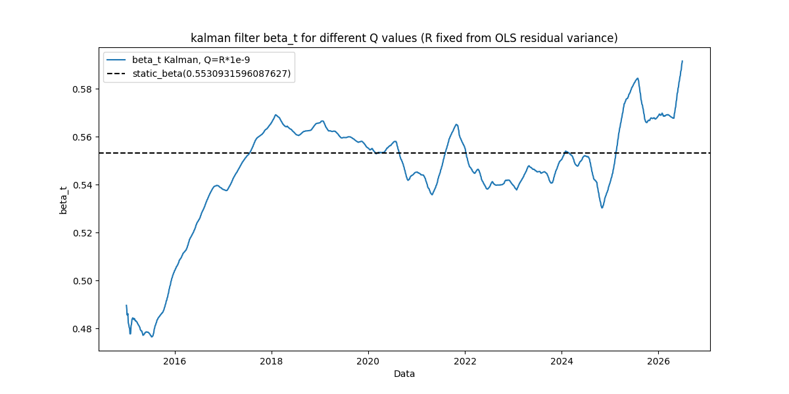
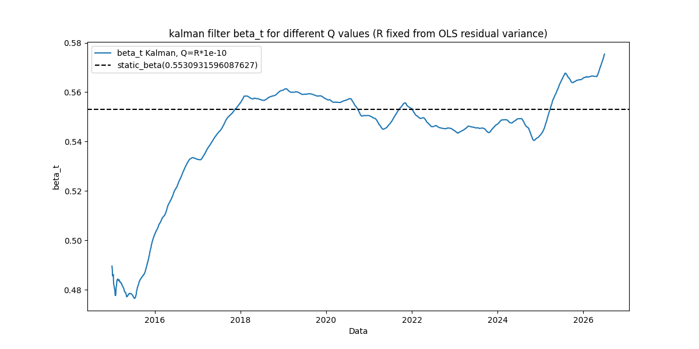
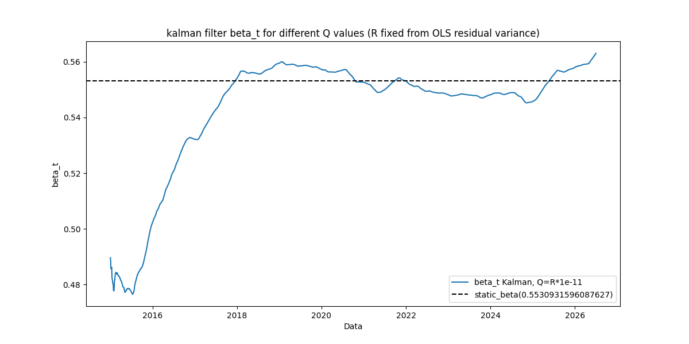

# Hege Ratio Tuning 
## Dynamic HEdge ratio : Kalaman Filter Tuning (V/Ma)

First attempts tried to fit a single static hedge ratio (beta = 0.5531) via Ordinary Least Sqaures Linear Regression on in-sample data 

$$\text{Price}_A = \alpha + \beta \cdot \text{Price}_B + \epsilon$$

which finds values for $\alpha$ and $\beta$ that minimizes Sum of Squares Error : 
$$\text{SSR} = \sum_{t=1}^{N} \left( \text{Price}_{A,t} - (\alpha + \beta \cdot \text{Price}_{B,t}) \right)^2$$

where $\beta$ was found to be 0.5531 for (2015-2021). The ADF p_value =0.0013 and half-life = 25 days confirmed that the pair is genuinely conintegrated.

This assumes that the replationship between the two assets never changes.
The next phase was to replace it with a Kalman filter that re-estimates $\beta$ at every time-step using data only upto and including that point(no lookahead), so the head ratio can adapt if the true relationship between V and MA drifts over an 11-year period.

# Model

### Random Walk
- **State (Random Walk):**
$$
\beta_t = \beta_{t-1} + w_t, \qquad
w_t \sim \mathcal{N}(0, Q)
$$

<!-- -**Observation:** -->

$$
\text{price}_{A,t} = \alpha + \beta_t \cdot \text{price}_{B,t} + v_t, \qquad
v_t \sim \mathcal{N}(0, R)
$$

$\alpha$ is held fixed at the value found by OLS, (could we model this drift in relationship within $\alpha$ itself?)
<!-- , only $\beta_t$ is modeled as a hidden state -->

R is set once, directly from the variance of the OLS residuals : 
$$\text{R} =  \text{var}\left( \text{Price}_{A,t} - (\alpha + \beta \cdot \text{Price}_{B,t}) \right)$$
Q (transition/process variance) has no direct data estimate, so we try to tune it 

## Tuning Process
**First pass (Q as multiples of R, 1e-6 to 10x):** all curves were visually
identical except a barely-distinguishable smoothest case. This showed the
filter saturates quickly — past a certain Q, the Kalman gain hits its
ceiling (bounded by R, since observation noise is never fully eliminable),
so further increasing Q has no additional effect.

**Second pass (Q from 1e-10 to 1e-6):** this was the actual transition zone.
`std(beta_t)` increased smoothly from 0.0219 (Q=R*1e-10) to 0.0265 (Q=R*1e-6),
but overall dispersion doesn't distinguish "real drift" from "chasing noise"
— both look like more/less movement.

**Deciding objectively, not by eye:** computed the lag-1 autocorrelation of
`beta_t.diff()` for each Q. A genuinely evolving structural parameter should
produce *persistent* day-to-day changes (positive autocorrelation); a filter
absorbing observation noise should look closer to independent increments
(autocorrelation decaying toward zero).
| Q          | diff_std | lag-1 autocorr |
|------------|----------|-----------------|
| R × 1e-10  | 0.00013  | 0.868           |
| R × 1e-09  | 0.00021  | **0.929**       |
| R × 1e-08  | 0.00041  | **0.931**       |
| R × 1e-07  | 0.00079  | 0.851           |
| R × 1e-06  | 0.00148  | 0.634           |

Autocorrelation peaks in the *middle* of the range (Q=R×1e-9 / R×1e-8, tied
at ~0.93), not at either extreme:
- At the noisy end (Q=R×1e-6), autocorrelation collapses to 0.634 — the
  classic sign of the filter reacting to observation noise rather than
  tracking real structure.
- At the over-smoothed end (Q=R×1e-10), autocorrelation is *lower* than the
  R×1e-9/1e-8 peak, not higher — heavy damping doesn't just flatten beta_t,
  it also lags the true drift enough to reduce coherence with it.

## Decision

**Q = R × 1e-9.** Statistically tied with R×1e-8 on persistence (0.929 vs.
0.931, within noise of each other), but with roughly half the day-to-day
step size (diff_std 0.00021 vs. 0.00041) — equal signal quality with less
unnecessary churn feeding into the downstream spread/z-score.
### at 1e-9:
| Date | spread | zscore |
| :--- | :--- | :--- |
| 2015-02-02 | 21.900375 | 0.541184 |
| 2015-02-03 | 22.534203 | 1.985989 |
| 2015-02-04 | 23.479660 | 3.714770 |
| 2015-02-05 | 24.240523 | 3.927023 |
| 2015-02-06 | 23.896632 | 2.408381 |
| 2015-02-09 | 23.205507 | 1.307636 |
| 2015-02-10 | 23.116549 | 1.097073 |
| 2015-02-11 | 23.406086 | 1.303628 |
| 2015-02-12 | 23.123671 | 0.931497 |
| 2015-02-13 | 22.965896 | 0.693684 |
| ... | ... | ... |
| 2026-06-16 | 39.811058 | 0.166139 |
| 2026-06-17 | 41.648066 | 0.923487 |
| 2026-06-18 | 40.107055 | 0.354059 |
| 2026-06-22 | 42.503933 | 1.524736 |
| 2026-06-23 | 41.749645 | 1.239779 |
| 2026-06-24 | 41.472744 | 1.089026 |
| 2026-06-25 | 42.677278 | 1.636987 |
| 2026-06-26 | 42.122577 | 1.309313 |
| 2026-06-29 | 40.970292 | 0.723713 |
| 2026-06-30 | 39.776215 | 0.215969 |

$\beta_t$

### At 1e-10
| Date | spread | zscore |
| :--- | :--- | :--- |
| 2015-02-02 | 21.900228 | 0.540931 |
| 2015-02-03 | 22.534080 | 1.985741 |
| 2015-02-04 | 23.479601 | 3.714686 |
| 2015-02-05 | 24.240564 | 3.927134 |
| 2015-02-06 | 23.896754 | 2.408536 |
| 2015-02-09 | 23.205678 | 1.307822 |
| 2015-02-10 | 23.116765 | 1.097280 |
| 2015-02-11 | 23.406362 | 1.303853 |
| 2015-02-12 | 23.124006 | 0.931762 |
| 2015-02-13 | 22.966270 | 0.693976 |
| 2026-06-16 | 46.278088 | 1.094134 |
| 2026-06-17 | 48.188195 | 2.017112 |
| 2026-06-18 | 46.766187 | 1.145593 |
| 2026-06-22 | 49.267880 | 2.409933 |
| 2026-06-23 | 48.745680 | 1.908532 |
| 2026-06-24 | 48.736614 | 1.683748 |
| 2026-06-25 | 50.045900 | 2.026636 |
| 2026-06-26 | 49.828919 | 1.699306 |
| 2026-06-29 | 49.019014 | 1.234104 |
| 2026-06-30 | 48.053218 | 0.821574 |

 Nan count in zscore : 20

### for 1e-11

| Date | spread | zscore |
| :--- | :--- | :--- |
| 2015-02-02 | 21.900375 | 0.541184 |
| 2015-02-03 | 22.534203 | 1.985989 |
| 2015-02-04 | 23.479660 | 3.714770 |
| 2015-02-05 | 24.240523 | 3.927023 |
| 2015-02-06 | 23.896632 | 2.408381 |
| 2015-02-09 | 23.205507 | 1.307636 |
| 2015-02-10 | 23.116549 | 1.097073 |
| 2015-02-11 | 23.406086 | 1.303628 |
| 2015-02-12 | 23.123671 | 0.931497 |
| 2015-02-13 | 22.965896 | 0.693684 |
| 2026-06-16 | 39.811058 | 0.166139 |
| 2026-06-17 | 41.648066 | 0.923487 |
| 2026-06-18 | 40.107055 | 0.354059 |
| 2026-06-22 | 42.503933 | 1.524736 |
| 2026-06-23 | 41.749645 | 1.239779 |
| 2026-06-24 | 41.472744 | 1.089026 |
| 2026-06-25 | 42.677278 | 1.636987 |
| 2026-06-26 | 42.122577 | 1.309313 |
| 2026-06-29 | 40.970292 | 0.723713 |
| 2026-06-30 | 39.776215 | 0.215969 |

